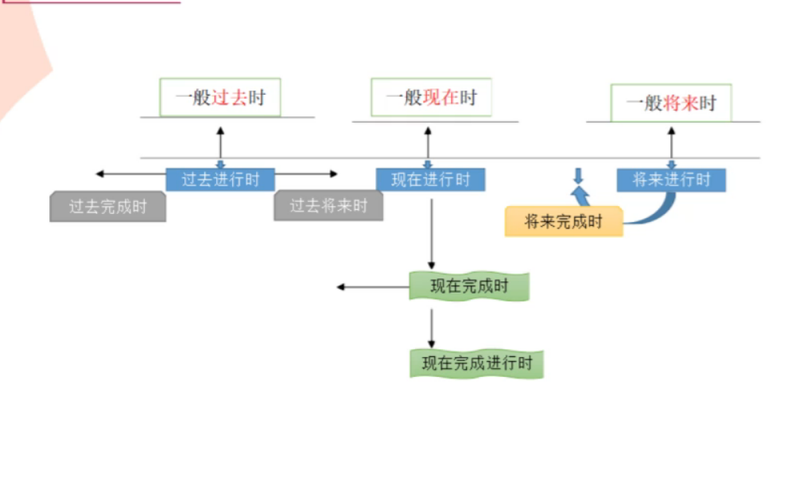

# 常用的时态形式
- 时间
- 状态

句子分为段动作和点动作；
- 当段动作发生了点动作，段动作用进行时(ing)，点动作用一般(不带词后缀)

# 1.时间

|状态|时态组合|描述|例子|重点|
|--------|--------|-------|--------|-------|
|过去完成时| had + Ved| had +动词加ed | No sooner had we arrived home than it started to rain| 点动作： 一到家就下雨；it started to rain |
|过去进行时| has / were +Ving| has 或 were+动词加ing|The report said the UFO was traveling east to west when he saw it | he saw it|
|过去将来时|would + V | would+动词原型 |He said he would stay with us.|一般现在时可替代过去将来时|
|一般过去时| Ved | 动词加ed | What did you say just now? |常用过去时间状语连用 如：yesterday（昨天），two days ago（两天前），last year（去年），the other day（前几天），once upon a time（过去曾经），just now（刚才），in the old days（过去的日子里）|
|现在完成进行时| have been + Ving | have been + 动词加ing|I have been looking forward to meeting you ever since we parted| 段动作：自从我们分开...然后...  ever since we parted|
|现在完成时| have +Ved   | have + 动词加ed 或has + 过去分词|Have you done it?| 现在完成时疑问句|
|现在进行时| as/is/are + Ving|as或is或are + 动词加Ving |They are cleaning the house.| 现在进行时的肯定句|
|一般现在时| V/Vs| 动词原型或动词加复数| We'll leave as soon as it stops raining|as 程度副词； 一停雨，我们就走|
|将来完成时| will + have + Ved | will + have +动词加ed |I need the job badly,as my money will have run out by the end of next month | the end of |
|将来进行时| will/shall be+Ving| will 或shall be + 动词加ing | I don't know what Jeanie will be doing at the time  tomorrow |段动作：明天这个时候....；this time tomorrow|
|一般将来时| will/shall +V|will或shall +动词原型 |He will win in the competition. | 用于判断将来会发生的事情：competition 比赛 |

## 1. 一般过去时 Ved
### 1.1 过去进行时 was/were+Ving
### 1.2 过去完成时 had+Ved
### 2.3 过去将来时 would+V

## 1.2. 一般现在时 动词原型或动词加复数V/Vs
### 1.2.1 现在进行时 am/is/are+Ving
### 1.2.2 现在完成时 have+Ved
### 1.2.3 现在完成进行时 have been Ving

## 1.3. 一般将来时 will/shall +V 动词原形
### 1.3.1 将来进行时 will/shall+be +Ving
### 1.3.2 将来完成时 will + have+Ved

# 2.状态有16种：
|状态类型|和时间组合方式| 描述|
|----------|-----------|---------|
|一般状态| V|动词原型|
|进行| be +Ving|be +动词后缀加ing|
|过去进行时| was +Ving|was +动词后缀加ing|
|完成| have+V| have + 动词原型
|完成进行| have been +Ving| have been + 动词后缀加ing|
|过去完成进行时| had been +Ving| had been  + 动词原型+ing|
|一般过去完成时| would +Ved| would  + 动词原型+ed|
|过去将来进行时|would be +Ving| would be + 动词后缀加ing|

### 2.1  过去  (时间： Ved)
### 2.1.1一般过去完成时状态 Ved：
- would +Ved

### 2.1.2 过去将来将来状态： would/should +V

### 2.1.2 过去将来进行时状态： be+Ving
- 加上时间组合就是： would be +Ving

## 2.2 过去将来 (时间：will/ shall  +V )

## 2.3 现在 （时间:V/Vs）：
### 2.3.1 现在完成时状态： had
- 加上时间组合：had + Ved
### 2.3.2 现在完成进行时状态：been
- 加上时间组合：have been ing 

## 2.4 将来： (时间：will/ shall V）
### 2.4.1 完成进行时状态
### 2.4.2 过去将来进行时状态
- would be +Ving