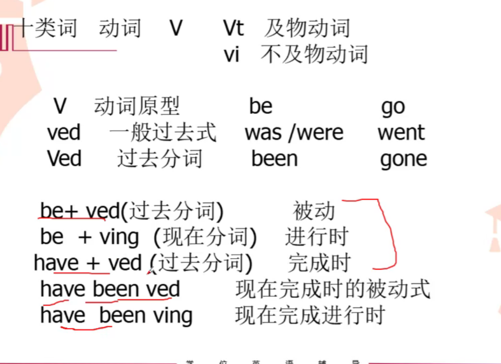

# 1. 不定式


# 2. 分词

1. 现在分词
   -  ing
2. 过去分词
    - V+ed

# 2.1 分词技巧：
```shell
如果ABCD是用一个词的不同形式选择的话， 考的是非谓语动词，
接下来只需要看这个词是及物还是不及物，
如果是及物动词，空格后面有自己的宾语，那么选择Ving,如果没有宾语的话，选Ved形式.

则 本该有名词的单词空格后面没有名词就选，Ved形式
```
- 否定词要放在句首：NOT  ... 


# 3. 动名词


# 分词
***注意***：
```

```