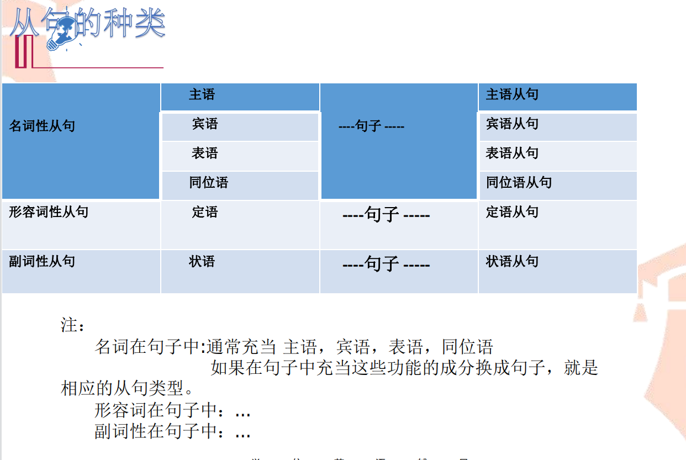

# 1. 从句的定义

- 从句 = 从+句
- 从=从属 不能单独存在
- 句= 具有句子的属性 句子完整 有自己的主谓（宾）/ 主系表
 
Eg:
  ```
  • I know that he loves you. • S V O
  • that he loves you , 不能单独存在
  • he loves you
  ```
# 2. 定语从句的判断依据
方法1：
1. 找先行词
2. 分析定语从句的成分
3. 确定关系词 主要是看谓语动词，如果是及物的话是主谓宾结构
4. 如果主谓宾结构完整的话是that,否则是what    ``` All that = what```
   
方法2：
1. 考虑关系词在句子中的成分，如果从句主谓宾都有了那么关系词应该是关系副词，如果从句缺主语或宾语，那么应该是关系代词。
2. 其次，如果前面都满足了，那我们要看先行词和关系词的之间的关系，判断是不是有从属关系。
3. 最后，确定关系代词是单数还是复数。因为who, that, which可以表示单数复数，具体要根据要根据先行词判断。简单来讲就是先成分判断，再关系判断，最后单复数判断。只要按照这个步骤，你肯定不会出错。
``` 

第1步，“找”——找到先行词。定语从句一般在所修饰的名词后，也就是先行词后。先行词，“先行”就是“走在前头”，那么走在谁的前头呢？走在定从的前头，指被定语从句修饰的名词或代词。

第2步，“析”——分析定语从句的成分。句子的成分包括：主语、谓语、表语、宾语（直接和间接宾语）、宾语补足语、定语和状语。
主语和谓语是句子的主体部分（在英语中，一般句子必须有主语和谓语），表语、宾语和宾语的补足语是谓语里的组成部分。其他成分如定语和状语是句子的次要成分。
当从句成分不完整的时候，我们用关系代词；相反，从句成分完整的时候，就用关系副词。

第3步，“定”——确定关系词。关系词，用来替代先行词，包括关系代词和关系副词。
关系代词（that, who, whom, whose, which）所代替的先行词是人或物的名词或代词，并在句中充当主语、宾语、定语等成分；
关系副词（when, where, why, that）可代替的先行词是时间、地点或理由的名词，在从句中作状语。
```

```
定语从句本身一般会缺少某种成分，比如
缺主语、缺宾语或缺状语
不过有一个万能的引导词that，

定语从句肯定是后置定语:
```
## 2.1 举例：
这两句话都译为“那个友好的女孩是我最好的朋友”：
- The friendly girl is my best friend.  定语 主语   // 前置定语
- The girl who is friendly is my best friend.  主语  定语从句  // 后置定语

## 2.3 记忆口诀
``` 
九阴真经之关系代词选定要诀

定从要学好，删繁就简系首要，明确先行词，然后定关系词调;

指人主格用who，宾格whom好，事物用which，主/宾都可靠;

用that引定从，人/物均需要，非限制性定从句，切勿用that导;

关系词作宾语，常将其省略掉，若介词+关系词，关系词切勿抛，无论人/事物，who/that均不导，指人必whom，事物which邀;

as引定从，(部分)主句内容包，常含“正如”意，位置任意挑;

which如此用，用时思量好，有时含“消极”味，主句之后到;

such/ the same + as，固定搭配好，特殊用法务牢记，勿用乱了套;

whose作定语，人/物它全包，n. + of + whom/which，可与其对调。
```

# 3. 名词性从句的种类
1. 主语从句
2. 宾语从句
3. 表语从句
4. 同位语从句

# 4. 动名词
- 定义：
- 动名词是由动词变化而来，它仍保留着动词的某些特征， 具有动词的某些变化形式，用以表达名词所不能表达的较为复杂的意义；
- 动名词本质上是一个名词。


# 5. 陈述句如何变名词性从句
1. That引导
2. 语序不变
3. 位置
## 5.1 主语从句
   • Does he know the answer to the question?
   • whether he knows the answer to the question makes no difference to me

## 5.2. 宾语从句
• Does he need my help?
• I don‘t know if/whether he needs my help.

## 5.3. 表语从句
• Will he come tomorrow?
• My question is whether he will come tomorrow

## 5.4. 同位语从句
• Is there life on the other planets?
• Scientists argue over the question whether there is life on the other
planets.


# 6. 一般疑问句如何变名词性从句
1. whether / if 保留其一定的疑问语气
2. 语序
3. 位置
## 6.1 1. 主语从句
   • when will the meeting begin ?
   • when the meeting will begin is unknown to us. 
   
## 6.2. 宾语从句
   • what is he talking about?
   • I know what he is talking about.

## 6.3. 表语从句
   • Where did they once live?
   • This is where they once lived. 

## 6.4. 同位语从句
-  Where could we get the loan ?
-  There arose the question where we could get the loan
- It is known to us that he broke his promise that he would give each of us a small gift is

# 7. 特殊疑问句如何变名词性从句
1. 特殊疑问词
2. 语序
3. 位置

# 8 总结
1. 引导词 陈述句 that
    - 一般疑问句 whether /if
    - 特殊疑问句 wh- 
2. 语序 陈述句 不变
    - 一般疑问句 变
    - 特殊疑问句 变
3. 位置


# 定语从句和名词从句的区别

定语从句 的that 是要做成分的        The news that you got is impossible.
名词性从句的that 是 不做句子成分的   The news that they will come is impossible.