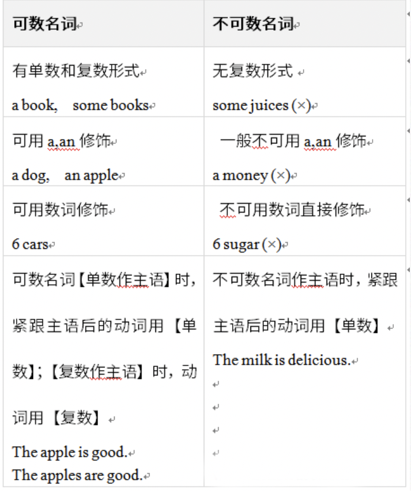

# 1. 名词
## 1.1 句子中用is和are的区别是什么？ 是不是用is和are是一样的？

example:
```
There is some water in the glass.
玻璃杯里有些水。
There are some cigarettes in the box.
盒子里有些雪茄。
```
问题 1.1 涉及到2个知识点：
1.  There be 句型
- 1、定义：There be句型表示某处存在某物或某人。
2. 结构：
- (1)There is +单数可数名词/不可数名词+ 地点状语.
- (2) There are +复数名词+地点状语.

可数名词和不可数名词，区别如下图


回答：
- 因为水本身不可数，但是加了glass 容器就变为可数的了，所以is 表示是单数可数名词，而are表示的是复数不可数名词


# 2 动词
## 2.1 什么情况下用to,什么情况下用the?
example:
```
Show her the magazine. 给她那本杂志。
Show it to her. 把它给她。
```
1. 在动词give/show后面可以有两个宾语：即直接宾语（指物，如a book, it）和间接宾语（指人，如me）
2. 如果直接宾语置于动词give之后，间接宾语之前则带to


# 3. 形容词

angrily [ˈæŋɡrɪlɪ] adv. 生气地
rudely [ˈru:dli] adv. 粗鲁地
loudly [laʊdlɪ] adv. 大声地

形容词(adj.)变副词(adv.)的一般规则
1、词尾直接+ly quick-quickly
2、以le结尾的形容词，把e改成y gentle-gently
3、以y结尾的形容词，变y为i，加ly guilty-guiltily


# 4. 词组和副词有什么区别